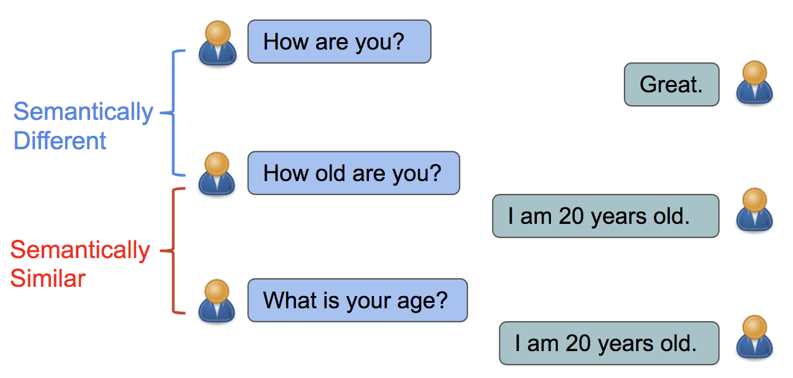
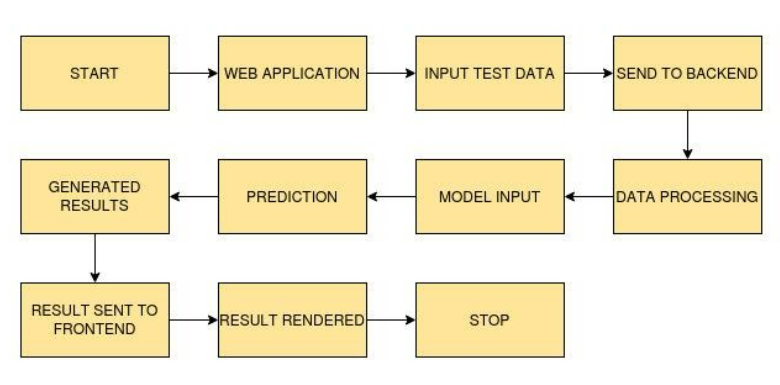

# Web-and-Clinical-Semantic-Textual-Similarity

## PROBLEM STATEMENT

  In this project we need to find the similarity for given pair of sentences and calculate the distance between them.
  
## DESCRIPTION

  Semantic textual similarity deals with determining how similar two pieces of texts are. This can take the form of assigning a score from 1 to 5. Related tasks are paraphrase or
  duplicate identification.
  Semantic similarity is a metric defined over a set of documents or terms, where the idea of distance between them is based on the likeness of their meaning or semantic contentas
  opposed to similarity which can be estimated regarding their syntactical representation (e.g. their string format). These are mathematical tools used to estimate the strength of
  the semantic relationship between units of language, concepts or instances, through a numerical description obtained according to the comparison of information supporting their
  meaning or describing their nature. The term semantic similarity is often confused with semantic relatedness. Semantic relatedness includes any relation between two terms, while
  semantic similarity only includes "is a" relations.

  For example, "car" is similar to "bus", but is also related to "road" and "driving".
  
## TECHNOLOGY USED

  Here we will be using  Anaconda Python 3.6 , Pytorch 1.4 with GPU support CUDA 10 with CuDNN 10.
  
## WORKFLOW DIAGRAM

